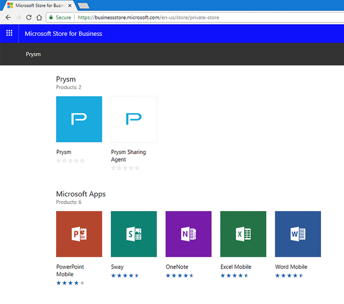

# Getting Prysm for desktop

## Installing Prysm for desktop

1. Go to the **Microsoft Store for Business**. [businessstore.microsoft.com/en-us/store](https://businessstore.microsoft.com/en-us/store)
2. Sign in with your company credentials. Prysm is available in your company store.

   

3. Click **Prysm Sharing Agent**.
 Clicking Prysm Sharing Agent to install it before you install Prysm is the fastest method for installation.

:::caution

If you don't install Prysm Sharing Agent, you won't be able to use [Prysm for desktop's sharing features](../Share/SharingYourDesktop.htm).

:::

4. Click **Install**. 
 Microsoft prompts you to open the Microsoft Store app.
5. Click **Open Microsoft Store**.
6. In the Microsoft Store app, click **Install** again.
 The Prysm Sharing Agent downloads and installs.
7. Click **Launch**.
 The Microsoft Store app automatically takes you to the page to install the Prysm app.
8. Click **Install** to install Prysm for desktop.
 Prysm for desktop downloads and installs.
9. Click **Launch**.
 Prysm for desktop opens, and you have access to all of its sharing features!

## Opening Prysm for desktop

1. If Prysm for desktop isn't already open on your device, here's how to open it: * In the Search field of your Windows 10 device, search for **Prysm** and select Prysm from the installed apps. * From the System Tray, select Prysm.

:::note
If you can't find Prysm, it might not be installed. See [Installing Prysm for Desktop](#InstalliingPFD) for information.

:::

2. [Sign in](SigningInToPrysm.html#DesktopSignIn) using network SSO credentials or your Prysm username and password.